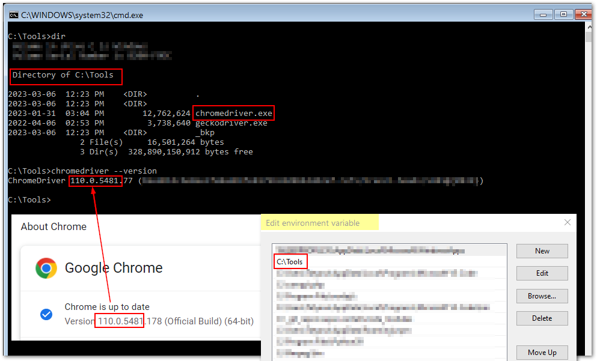

#  Selenium Mocha Framework Demo 

 <mark>Page Object Model based Test Automation Framework with Selenium WebDriver, Mocha Testing Framework, Chai Assertion Library and Mochawesome Reports</mark> :coffee:


## Prerequisites
* [Node.js](https://nodejs.org/) (with npm)
* [Visual Studio Code](https://code.visualstudio.com/download)
* Basic Knowledge of JavaScript 
* Basic understanding of [Selenium WebDriver](https://selenium.dev)
* Basic knowledge of Command Line Interface (CLI) and running commands in Terminal 
* Basic understanding of git version control and :octocat: GitHub source control technologies


## How Selenium Works with different browsers
To use Selenium with different browsers, you need to download and install the appropriate web driver for each browser you want to automate. Here's where you can download the drivers for each browser:

**Google Chrome**: The ChromeDriver can be downloaded from the official Selenium website at https://sites.google.com/a/chromium.org/chromedriver/downloads. You can download the driver version that matches your Chrome browser version.

**Mozilla Firefox**: The GeckoDriver can be downloaded from the official Mozilla GitHub page at https://github.com/mozilla/geckodriver/releases. You can download the driver version that matches your Firefox browser version.

**Microsoft Edge**: The EdgeDriver can be downloaded from the official Microsoft website at https://developer.microsoft.com/en-us/microsoft-edge/tools/webdriver/. You can download the driver version that matches your Edge browser version.

**Safari**: The SafariDriver is built into the Safari browser and is enabled through the Develop menu. To enable the Develop menu, go to Safari Preferences -> Advanced and check "Show Develop menu in menu bar". Then, go to the Develop menu and select "Allow Remote Automation".

Once you have downloaded and installed the appropriate driver for each browser, you can use Selenium to automate the interaction with the browser in your test scripts.

## Install Browser Drivers (Chrome browser)

* Check the version of your Browser.
* Download compatible browser driver i.e [chromedriver](https://sites.google.com/a/chromium.org/chromedriver/downloads).
* Extract the chromedriver.exe to the local directory, i.e. C:/Tools.
* Add C:/Tools to the PATH variable (Environment Variable) - this step may require restart.
* Verify the chromedriver.exe binary works by running the following command in a command prompt or terminal window:

```shell
chromedriver --version
```



# Creating Selenium Framework


## Create Project Directory

`i.e. C:/_git_repos/selenium-mocha/>`

This step can be done via file explorer or Terminal Window (in Command Prompt in Windows, for example)

```shell
mkdir selenium-mocha
```

## Create /test folder
```shell
cd selenium-mocha
mkdir test
```


# Install Dependencies
Start VSCode and open project folder.

Run the following commands in Terminal window:


### 1. Initialize Node.js Project

```shell
npm init -y
```

### 2. Install Selenium
```shell
npm install selenium-webdriver
```

### 3. Install Testing Framework

The "***npm install mocha***" command installs the Mocha test framework as a development dependency for your project. Mocha is a popular JavaScript test framework that is used to run automated tests for web applications.

The "***npm install mocha-selenium***" command installs the ***Mocha Selenium adapter*** as a development dependency for your project. The Mocha Selenium adapter is a library that allows you to run Selenium tests with Mocha. 

```shell
npm install mocha
```
```
npm install mocha-selenium
```

### 4. Install Assertion Library
```shell
npm install chai
```

### 5. Install Reporting Framework
```bash
npm install --save-dev mochawesome
```

# Create Selenium script

### Common interactions with web elements using Selenium and JavaScript

```js
// Click a button
await driver.findElement(By.id("button-id")).click();

// Type text into a text field
await driver.findElement(By.id("text-field-id")).sendKeys("Hello, World!");

// Get the text content of an element (div)
var divText = await driver.findElement(By.id("div-id")).getText();
console.log(divText);

// Select an option from a select element
await new Select(driver.findElement(By.id("select-id"))).selectByValue("option-value");

// Check or uncheck a checkbox
await driver.findElement(By.id("checkbox-id")).click();

// Enter text and press a keyboard key
// add the following import to the top of the file
const { Key } = require("selenium-webdriver");

await driver.findElement(By.name("searchBox")).sendKeys("Selenium WebDriver", Key.RETURN);
await driver.findElement(By.css("#my-input")).sendKeys("text to enter", Key.TAB);

```

### Locator strategies in Selenium with JavaScript
#### ID
```js
// Click a button using ID
await driver.findElement(By.id("button-id")).click();
```
#### Class Name
```js
// Click a button using class name
await driver.findElement(By.className("button-class")).click();
```
#### Name
```js
// Click a button using name
await driver.findElement(By.name("button-name")).click();
```
#### Xpath
```js
// Click a button using XPath
await driver.findElement(By.xpath("//button[text()='Click me']")).click();

```


## Create new test in /test directory
:bulb: Test name should end with either .**test**.js or .**spec**.js 
```
login.spec.js
```
## Create a basic linear script
Developing an automated script using Selenium and JavaScript involves two phases: 
- linear script development and 
- page object model (POM) based script development. 

In the linear script development phase, we develop the script by hardcoding the locators and data values directly into the script. This approach is quick and easy to implement but can be difficult to maintain and update in the long run.

Once the linear script is developed, we can refactor it into a more efficient and maintainable page object model (POM) based script. In the POM based script development phase, we separate the locators and actions from the script into separate page object files.


```js
// login.spec.js
// ===================

const { Builder, By } = require("selenium-webdriver");
const { expect } = require("chai");

describe("Login page tests - Basic", function() {
  this.timeout(50000);
  let driver;

  it("should allow a user to login with correct credentials", async function() {
    driver = await new Builder().forBrowser("chrome").build();
    await driver.get("https://the-internet.herokuapp.com/login");
    await driver.findElement(By.name("username")).sendKeys("tomsmith");
    await driver.findElement(By.name("password")).sendKeys("SuperSecretPassword!");
    await driver.findElement(By.css(".radius")).click();

    const successMsg = await driver.findElement(By.id("flash")).getText();
    expect(successMsg).to.contain("You logged into a secure area!");
    await driver.quit();
  });

  it("should display an error message for incorrect login", async function() {
    driver = await new Builder().forBrowser("chrome").build();
    await driver.get("https://the-internet.herokuapp.com/login");
    await driver.findElement(By.name("username")).sendKeys("dummy");
    await driver.findElement(By.name("password")).sendKeys("dummy");
    await driver.findElement(By.css(".radius")).click();

    const errorMsg = await driver.findElement(By.id("flash")).getText();
    expect(errorMsg).to.contain("Your username is invalid!");
    await driver.quit();
  });
});
```

# Run Test :heavy_check_mark:
In terminal window run the following command:
```shell
npx mocha test\login.spec.js
```


## Configure Test Run Command
and specify default script timeout.

Open **package.json** file and update **"scripts"** section as follows:

```json
  "scripts": {
    "test": "mocha --timeout 10000"
  }
```

## Run Test (new run comman)
run all tests in the /test folder
```
npm test
```
run specific test
```
npm test test\login.spec.js
```
# Using Mochawesome Reporter
## Update test run command

Open **package.json** file and update **"scripts"** section as follows

```json
  "scripts": {
    "test": "mocha --timeout 10000 --reporter mochawesome"
  },
  ```
  then
  ```
  npm test
  ```
## View Mochawesome Report 
Get location from the terminal window and open it in the brower, for example: 
```shell
[mochawesome] Report HTML saved to C:\_git_repos\selenium-mocha\mochawesome-report\mochawesome.html
```
## ...et voila! :sunglasses:


# Page Object Model Design Pattern
Page Object Model (POM) is a common design pattern used in QA Automation.

* With POM Web pages are represented with corresponding Classes (i.e LoginPage Class, HomePage Class).
* GUI Elements Locators are stored in a separate Repository file (i.e locators.js).
* Interactions with the elements are done via the Class methods (functions).
* Tests contain function calls to perform required actions.

Using POM design pattern makes the code more maintainable, readable, reusable and optimized.

## Create additional files/folders

### Locators/Data file

```shell
/resources/locators.js
```
Add the following content
```js
// locators.js
// ===========

const locators = {
  username: "#username",
  password: "#password",
  submitButton: 'button[type="submit"]',
  errorMessage: "#flash.error",
  successMessage:"#flash.success",
  loginPageHeading: "h2",
  secureAreaPageHeading: "h2",
  logoutButton: ".button.secondary.radius",
};

const data = {
  baseUrl: "https://the-internet.herokuapp.com/login",
  pageTitle: "The Internet",
  username: "tomsmith",
  password: "SuperSecretPassword!",
  loginPageHeading: "Login Page",
  secureAreaPageHeading: "Secure Area",
  errorMessage: "Your username is invalid!",
  successMessage: "You logged into a secure area!",
};

module.exports = { locators, data };
```

### Login Page Class file

```shell
/pages/LoginPage.js
```
Add the following content
```js
// LoginPage.js
// ==========

const { By } = require("selenium-webdriver");
const { expect } = require("chai");
const { locators, data } = require("../resources/locators");


class LoginPage {

  constructor(driver) {
    this.driver = driver;
  }

  // class methods 

  async goto() {
    await this.driver.get(data.baseUrl);
  }

  async loginAs(username, password) {
    await this.driver.findElement(By.css(locators.username)).sendKeys(username);
    await this.driver.findElement(By.css(locators.password)).sendKeys(password);
    await this.driver.findElement(By.css(locators.submitButton)).click();
  }

  async validatePageUrl(expectedUrl) {
    const actualUrl = await this.driver.getCurrentUrl();
    const res = expect(actualUrl).to.equal(expectedUrl);
    return res;
  }

  async validatePageTitle(expectedTitle) {
    const actualTitle = await this.driver.getTitle();
    const res = expect(actualTitle).to.equal(expectedTitle);
    return res;
  }

  async validateSuccessMessage() {
    await this.validatePageText("successMessage");
  }

  async validateErrorMessage() {
    await this.validatePageText("errorMessage");
  }

  async validateLoginPageHeading() {
    await this.validatePageText("loginPageHeading");
  }

  async validateSecureAreaPageHeading() {
    await this.validatePageText("secureAreaPageHeading");
  }

    async logout() {
    await this.driver.findElement(By.css(locators.logoutButton)).click();
  }

  // common methods

  async validatePageText(val) {
    const element = await this.driver.findElement(By.css(locators[val]));
    const txt = await element.getText();
    const res = expect(txt).to.contain(data[val]);
    return res;
  }
}

module.exports = LoginPage;


```

### New Test File

```shell
/test/login.pom.spec.js
```
Add the following code
```js
// login.pom.spec.js
// page object model design pattern
// ===================

const { Builder } = require("selenium-webdriver");
const LoginPage = require("../pages/LoginPage");
const { data } = require("../resources/locators");

describe("Login page tests - POM, before() and after() hooks", function () {
  let driver;
  let loginPage;

  before(async function () {
    driver = await new Builder().forBrowser("chrome").build();
    loginPage = new LoginPage(driver);
    await loginPage.goto();
  });

  after(async function () {
    if (driver) {
      await driver.quit();
    }
  });

  describe("1. Correct username and password", function () {
    it("1.1. should show the secure area heading and success message", async function () {
      await loginPage.validatePageTitle(data.pageTitle);
      await loginPage.validatePageUrl(data.baseUrl);
      await loginPage.loginAs(data.username, data.password);
      await loginPage.validateSecureAreaPageHeading();
      await loginPage.validateSuccessMessage();
      await loginPage.logout();
      await loginPage.validateLoginPageHeading();
    });
  });

  describe("2. Incorrect username and/or password", function () {
    it("2.1 should stay on Login page and show an error message", async function () {
      await loginPage.loginAs("dummy", "dummy");
      await loginPage.validateErrorMessage();
      await loginPage.validateLoginPageHeading();
    });
  });
});

```
### Run New Test
```shell
npm test test/login.pom.spec.js
```
### View Results in Mochawesome Report


# Use this project
### clone to your machine
```shell
git clone https://github.com/kiseta/selenium-mocha.git
```
### Install Dependencies
open project in VSCode, run in Terminal
```shell
npm install
```
### Run tests
```shell
npm test
```
### Adding More Tests

* Add locators and data to locators.js file
* Add new page file i.e. FormPage.js and create FormPage Class in it
* Create corresponding methods in new FormPage Class
* Create new test file and build a sequence of steps and validations
* Run your tests!

Good luck!  :rocket: :crossed_fingers: :four_leaf_clover: :thumbsup:

<hr />

## :bulb: About using `async` and `await` keywords

The `async` and `await` keywords are used to make WebDriver API calls that return promises, such as driver.findElement and driver.get, and wait for them to complete before continuing execution of the test. 

By using `await` with these calls, we ensure that the test doesn't continue until the browser has finished loading the page or found the element we are looking for, and we can then interact with the page in a predictable way.

### Additional Resources:

- Mozilla Developer Network (MDN) has a great guide to async/await, which covers the basics of how they work and includes code examples. You can find it here: https://developer.mozilla.org/en-US/docs/Learn/JavaScript/Asynchronous/Async_await

- The JavaScript.info website has an excellent in-depth tutorial on async/await, which covers topics like error handling, sequential and parallel execution, and more advanced concepts. You can find it here: https://javascript.info/async-await

- The Node.js documentation also has a section on async/await, which covers how to use them with Node.js APIs and modules. You can find it here: https://nodejs.org/en/knowledge/getting-started/control-flow/what-are-callbacks/#promises

## :crystal_ball: Troubleshooting

When creating methods in your class file make sure each method (function) name starts with **async** keyword, each step that interacts with application starts with the  **await** keyword and when using the driver in class file refer to it using **this.driver** notation


