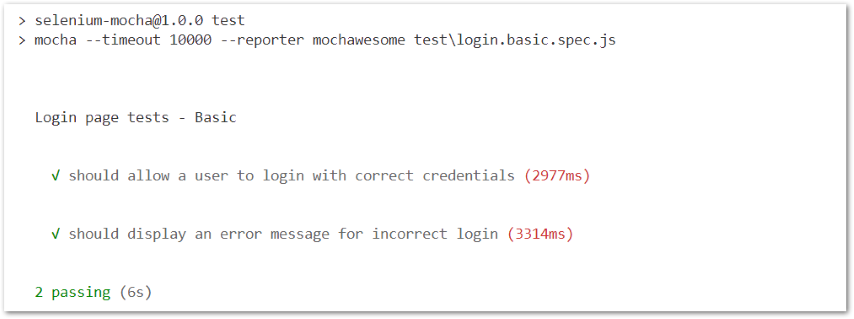
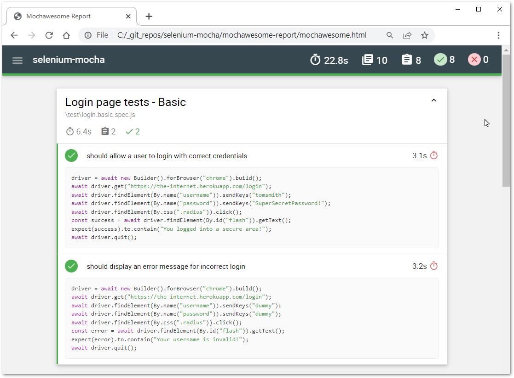
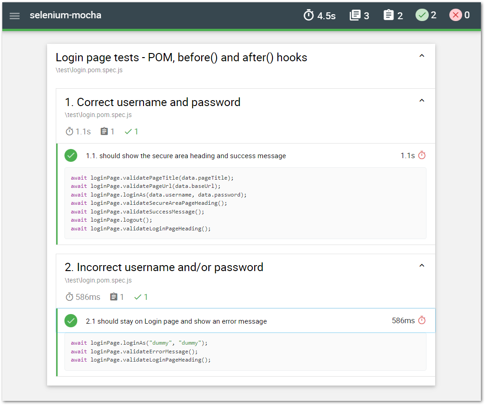

# Selenium Framework Test Automation Demo Project
## Prerequisites
* [Node.js](https://nodejs.org/) (with npm)
* [Visual Studio Code]()
* Basic Knowledge of JavaScript 
* Basic understanding of [Selenium WebDriver](https://selenium.dev)

# Create Project Directory
i.e. C:/_git_repos/selenium-mocha/>
```shell
mkdir selenium-mocha
```
## Go to Project directory
```shell
cd selenium-mocha
```
## Create /test folder
```shell
mkdir test
```

# Install Dependencies
Run the following commands in Terminal window in project directory 


### Initialize Node.js Project (-y accepts all defaults silently)
```shell
npm init -y
```

### Install Selenium
```shell
npm install selenium-webdriver
```

### Install Browser drivers

#### Chrome
```shell
npm install chromedriver
```
#### Firefox (optional)
```shell
npm install geckodriver
```

### Install Testing Framework
```shell

npm install mocha
npm install mocha-selenium

```
### Install Validation Framework
```shell
npm install chai
```

### Install Reporting Framework
```bash
npm install --save-dev mochawesome
```

# Create Selenium script

### Create new test in /test directory
Note: Test name should end with either .**test**.js or .**spec**.js 
```
login.spec.js
```
### Add the following code
```js
// login.spec.js
// ===================

const { Builder, By } = require("selenium-webdriver");
const { expect } = require("chai");

describe("Login page tests - Basic", () => {
  let driver;

  it("should allow a user to login with correct credentials", async () => {
    driver = await new Builder().forBrowser("chrome").build();

    await driver.get("https://the-internet.herokuapp.com/login");
    await driver.findElement(By.name("username")).sendKeys("tomsmith");
    await driver.findElement(By.name("password")).sendKeys("SuperSecretPassword!");
    await driver.findElement(By.css(".radius")).click();

    const success = await driver.findElement(By.id("flash")).getText();
    expect(success).to.contain("You logged into a secure area!");
    await driver.quit();
  });

});
```

# Run Test :heavy_check_mark:
```
npx mocha login.spec.js
```



## Configure Test Run Command in package.json

and specify default script timeout
```json
  "scripts": {
    "test": "mocha --timeout 10000"
  }
```

## Run Test (new run comman)
run all tests in the /test folder
```
npm test
```
run specific test
```
npm test test\login.spec.js
```
# Using Mochawesome Reporter
## Update test run command in package.json

```json
  "scripts": {
    "test": "mocha --timeout 10000 --reporter mochawesome"
  },
  ```
  then
  ```
  npm test
  ```
## View Mochawesome Report 
Get location from the terminal i.e 
```shell
[mochawesome] Report HTML saved to C:\_git_repos\selenium-mocha\mochawesome-report\mochawesome.html
```
## ...et voila! :sunglasses:


# Page Object Model Design Pattern

## Create additional files/folder

### Login Page Class file

```shell
/pages/LoginPage.js
```
Add the following content
```js
// LoginPage.js
// ==========

const { By } = require("selenium-webdriver");
const { expect } = require("chai");
const { locators, data } = require("../resources/locators");

class LoginPage {
  constructor(driver) {
    this.driver = driver;
  }

  async goto() {
    await this.driver.get(data.baseUrl);
  }

  async loginAs(username, password) {
    await this.driver.findElement(By.css(locators.username)).sendKeys(username);
    await this.driver.findElement(By.css(locators.password)).sendKeys(password);
    await this.driver.findElement(By.css(locators.submitButton)).click();
  }

  async validatePageUrl(expectedUrl) {
    const actualUrl = await this.driver.getCurrentUrl();
    const res = expect(actualUrl).to.equal(expectedUrl);
    return res;
  }

  async validatePageTitle(expectedTitle) {
    const actualTitle = await this.driver.getTitle();
    const res = expect(actualTitle).to.equal(expectedTitle);
    return res;
  }

  async validateSuccessMessage() {
    await this.validatePageText("successMessage");
  }

  async validateErrorMessage() {
    await this.validatePageText("errorMessage");
  }

  async validateLoginPageHeading() {
    await this.validatePageText("loginPageHeading");
  }

  async validateSecureAreaPageHeading() {
    await this.validatePageText("secureAreaPageHeading");
  }

  async validatePageText(val) {
    const element = await this.driver.findElement(By.css(locators[val]));
    const txt = await element.getText();
    const res = expect(txt).to.contain(data[val]);
    return res;
  }

  async logout() {
    await this.driver.findElement(By.css(locators.logoutButton)).click();
  }
}


module.exports = LoginPage;
```
### Locators/Data file

```shell
/resources/locators.js
```
Add the following content
```js
// locators.js
// ===========

const locators = {
  username: "#username",
  password: "#password",
  submitButton: 'button[type="submit"]',
  errorMessage: "#flash.error",
  successMessage:"#flash.success",
  loginPageHeading: "h2",
  secureAreaPageHeading: "h2",
  logoutButton: ".button.secondary.radius",
};

const data = {
  baseUrl: "https://the-internet.herokuapp.com/login",
  pageTitle: "The Internet",
  username: "tomsmith",
  password: "SuperSecretPassword!",
  loginPageHeading: "Login Page",
  secureAreaPageHeading: "Secure Area",
  errorMessage: "Your username is invalid!",
  successMessage: "You logged into a secure area!",
};

module.exports = { locators, data };
```
### New Test File

```shell
/test/login.pom.spec.js
```
Add the following code
```js
// login.pom.spec.js
// page object model design pattern
// ===================

const { Builder } = require("selenium-webdriver");
const LoginPage = require("../pages/LoginPage");
const { data } = require("../resources/locators");

describe("Login page tests - POM, before() and after() hooks", function () {
  let driver;
  let loginPage;

  before(async function () {
    driver = await new Builder().forBrowser("chrome").build();
    loginPage = new LoginPage(driver);
    await loginPage.goto();
  });

  after(async function () {
    if (driver) {
      await driver.quit();
    }
  });

  describe("1. Correct username and password", function () {
    it("1.1. should show the secure area heading and success message", async function () {
      await loginPage.validatePageTitle(data.pageTitle);
      await loginPage.validatePageUrl(data.baseUrl);
      await loginPage.loginAs(data.username, data.password);
      await loginPage.validateSecureAreaPageHeading();
      await loginPage.validateSuccessMessage();
      await loginPage.logout();
      await loginPage.validateLoginPageHeading();
    });
  });

  describe("2. Incorrect username and/or password", function () {
    it("2.1 should stay on Login page and show an error message", async function () {
      await loginPage.loginAs("dummy", "dummy");
      await loginPage.validateErrorMessage();
      await loginPage.validateLoginPageHeading();
    });
  });
});

```
### Run New Test
```shell
npm test test/login.pom.spec.js
```
### View Results in Mochawesome Report



# Use this project
### clone to your machine
```shell
git clone https://github.com/kiseta/selenium-mocha.git
```
### Install Dependencies
open project in VSCode, run in Terminal
```shell
npm install
```
### Run tests
```shell
npm test
```
### Adding More Tests

* Add locators and data to locators.js file
* Add new page file i.e. FormPage.js and create FormPage Class in it
* Create corresponding methods in new FormPage Class
* Create new test file and build a sequence of steps and validations


